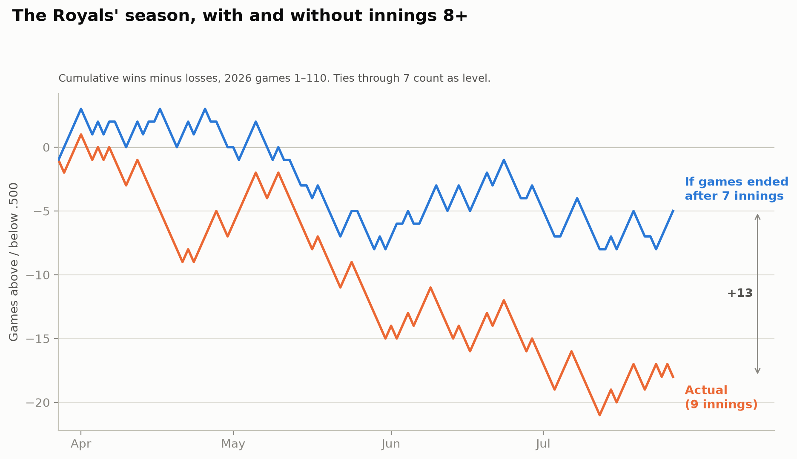
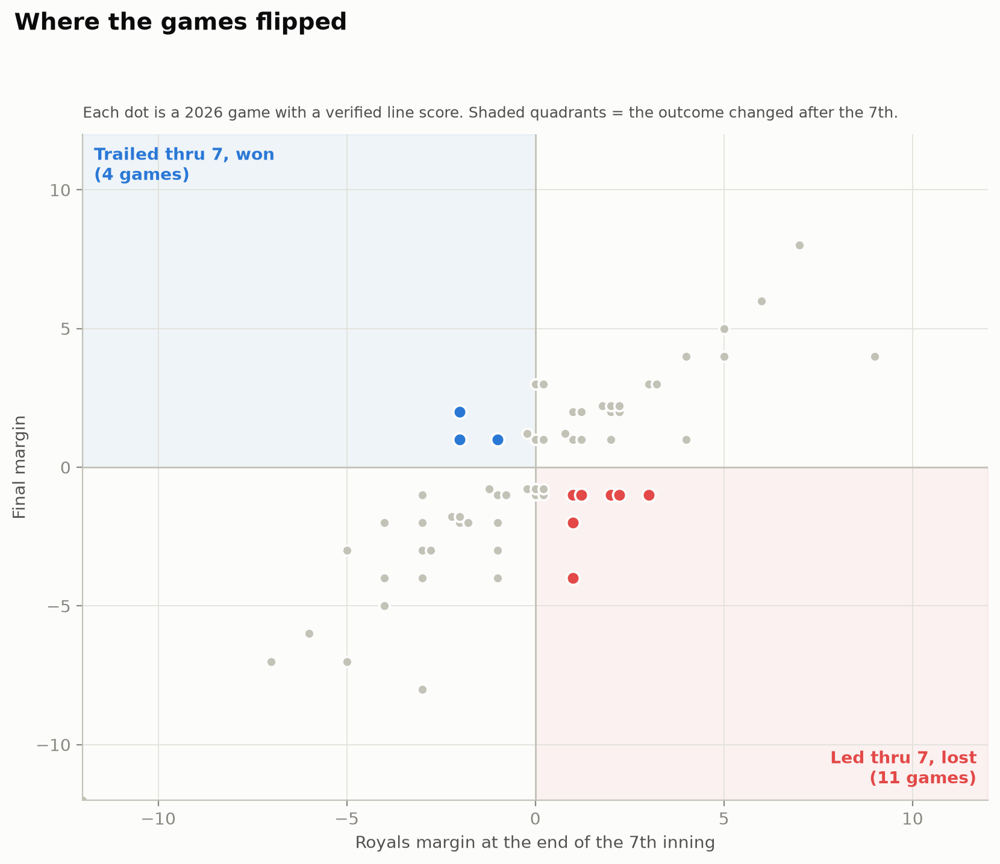
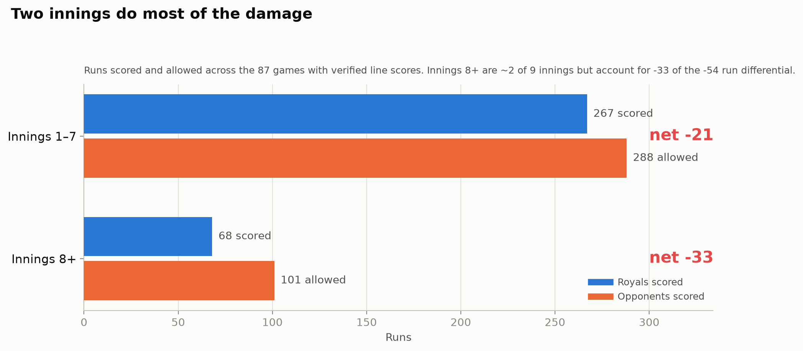

# What if every Royals game ended after 7 innings? A 2026 counterfactual

> Date: 2026-07-30 (updated 2026-07-31 with box-score verification and figures)
> Author: Baseball-Thoughts (compiled with Claude)

## Question

The Royals keep throwing away their leads. What would the 2026 season look like if every game simply ended after 7 innings — no 8th, no 9th, no extras?

## Hypothesis

If the "blown leads" impression is real, the Royals' after-7 record should be meaningfully better than their actual record: more standings value lost in innings 8+ than gained, driven by late bullpen failures rather than a lack of late offense.

## Data

- **Two independent passes.** Pass 1 reconstructed every game's score through 7 innings from game recaps (AP wire, ESPN, MLB.com, team SB Nation sites). Pass 2 re-verified all 110 games against box-score-grade sources — Baseball Almanac box pages, plaintextsports line scores, ESPN box scores, and AP recaps that itemize every scoring play — and corrected six games (list under Method).
- **Structured sources were unreachable.** This environment's network policy blocks the MLB Stats API, ESPN's API, Baseball-Reference, Baseball Savant, and HuggingFace (where the weekly-updated `statcast-era-pitches` archive lives). The only open host family is GitHub: Neil Paine's maintained MLB Elo game-results CSV was pulled from `Neil-Paine-1/MLB-WAR-data-historical` as a candidate independent source for final scores, but its data ends with the 2025 season. All verification therefore ran through the web-search layer against the box-score sources above.
- Time window: 2026-03-27 (Opening Day) through 2026-07-30 — 110 regular-season games, all resolved.
- Coverage: **87 games have exact through-7 line scores for both teams**; the other 23 have one side bounded (e.g., "11–13") with the after-7 winner still arithmetically certain. Zero games unresolved.
- Cross-checks: season-record checkpoints reconcile exactly (35-51 entering July 1; 41-60 after July 20; 43-62 after July 24; 46-64 after July 30).

## Method

For each game, the score at the completion of the 7th inning was taken from line scores where available, otherwise reconstructed from itemized scoring plays. Each game gets an after-7 result: W, L, or T (tied through 7 — in this thought experiment, ties stand). Games with a certain after-7 winner but partially bounded scores count in the record but are excluded from run-differential math.

Corrections made by the verification pass: **May 2** (was unresolved → KC trailed 1-2 through 7 of a 10-inning game they won), **May 24** (5-3 lead, tie scenario eliminated), **June 4** (6-5 through 7, not 6-6 — Caratini's tying homer came in the 8th), **July 5** (2-2 tie, not a KC lead — Perez's sealing double came in the 8th), **July 10** (KC trailed 2-3 through 7; the 3-3 tie only existed mid-8th), and **July 30** (was unresolved → KC led 3-0 through 7 *and 8* and lost on a 9th-inning walk-off grand slam).

Data: [`data/processed/2026_royals_after7_gamelog.csv`](../../data/processed/2026_royals_after7_gamelog.csv) (110 rows, per-game confidence grades, line scores in notes).
Analysis: [`scripts/seven_inning_counterfactual.py`](../../scripts/seven_inning_counterfactual.py) · Figures: [`scripts/plot_seven_inning.py`](../../scripts/plot_seven_inning.py)

## Results

### The headline

| | Record | Win % |
|---|---|---|
| **Actual season (110 games)** | 46-64 | .418 |
| **If games ended after 7 (same 110 games)** | **46-51-13** | **.477** (ties as half) |

The 7-inning Royals sit a hair under .500. The 9-inning Royals are on a 68-win pace. Innings 8 and beyond have cost Kansas City **6.5 wins of standings value through July 30** — a ~10-win swing over a full season.

### Eleven blown games — including the very night this question was asked

The Royals led at the end of the 7th in **eleven games they went on to lose**; only **four times** did they trail after 7 and come back to win. Eight of the eleven ended as walk-off losses.

| Date | Opp | Led thru 7 | Final | How it died |
|---|---|---|---|---|
| Mar 28 | @ ATL | 1-0 | L 2-6 | Up 2-0 with two out in the 9th; Dominic Smith walk-off grand slam capped a 6-run 9th |
| Apr 14 | @ DET | 1-0 | L 1-2 | Tigers scored twice in the 8th on a passed ball and a double |
| Apr 16 | @ DET | 8-6 | L 9-10 | Led 9-7 in the 9th; Greene 2-run double, Keith walk-off single |
| Apr 20 | vs BAL | 1-0 | L 5-7 (12) | One strike from a 1-0 win; Basallo tying single in the 9th, Taveras grand slam in the 12th |
| May 30 | @ TEX | 4-3 | L 6-7 | Up 6-4 in the 9th; five straight hits off closer Lucas Erceg, walk-off single |
| Jun 2 | @ CIN | 3-1 | L 3-4 (10) | Cameron's one-hitter through 7 wasted; Benson tying HR off Erceg in the 9th, walk-off in the 10th |
| Jun 10 | vs TEX | 4-3 | L 4-6 (10) | Walk-walk-HBP loaded the bases in the 8th, tying sac fly; bases-loaded walk lost it in the 10th |
| Jun 13 | vs HOU | 7-5 | L 7-8 | Altuve tying HR in the 8th; winning run scored on a botched double-play throw in the 9th |
| Jul 8 | @ NYM | 2-1 | L 2-6 | Five-run 8th off Lange/Cuas: bases-loaded HBP, two-run single, wild pitch |
| Jul 28 | @ MIN | 2-1 | L 2-3 | Two out in the 9th; Royce Lewis two-run walk-off triple |
| **Jul 30** | @ MIN | **3-0** | **L 3-4** | **Cameron threw 8 shutout innings; Erceg loaded the bases in the 9th and Kody Clemens hit a walk-off grand slam** |

### Thirteen ties — and the Royals actually win the late innings of tied games

Thirteen games were tied through 7 (12% of the season). Here the Royals came out ahead: they won 7 of the 13 in real life (including Salvador Perez's record-breaking 318th-HR game on Jul 25, the Jensen walk-off against San Diego on Jul 17, and the Jul 5 Phillies game sealed by Perez's 8th-inning double) and lost 6 — three of those by walk-off (Rocchio, Pozo, Gonzalez). The disaster is specifically **protecting leads**, not playing from even.

### The run-differential anatomy

Over the 87 games with complete line scores, the Royals were outscored by 21 through seven innings — they are not secretly a good team for seven frames; the 22-1 and 19-2 blowouts are real. But innings 8+ produced a **−33 differential (68 scored, 101 allowed) in roughly two innings a game**: per inning, the late innings have been about **five times worse** than innings 1–7 (−0.19 runs/inning vs −0.03). The record gap comes precisely from close games: an 11-to-4 blown-lead imbalance and a .418 season that would be .477 without the last two innings.

### Month by month

| Month | Actual | After 7 innings | Swing (ties = ½) |
|---|---|---|---|
| March | 2-2 | 3-1 | +1 |
| April | 10-17 | 11-13-3 | +2.5 |
| May | 10-18 | 8-16-4 | ±0 |
| June | 13-14 | 14-10-3 | +2.5 |
| July (thru 7/30) | 11-13 | 10-11-3 | +0.5 |

May is the honest month: the Royals were simply bad for nine innings, and twice stole games late (the Isbel walk-off May 8, the 10-inning May 2 win in Seattle). Every other month, the last two innings took wins off the board.

### The culprits have names

The blown games cluster around the same arms. **Lucas Erceg** has four of them: the Volpe two-run single (May 25, tied game), five straight hits in Texas (May 30), Benson's tying homer (Jun 2), and the Clemens walk-off grand slam (Jul 30). **Matt Strahm** allowed the decisive 8th-inning homer three times in tied games (May 12 Hill, Jun 6 Arcia, Jul 10 Basallo). The **Lange/Cuas** five-run 8th lost Jul 8. Two more died on defense (the Jun 13 double-play throw, Jul 28 after five double plays had kept KC ahead). The offense is not the problem late — 68 runs scored in innings 8+, and 7 of 13 after-7 ties won — the runs allowed are.

## Limitations

- No structured API was reachable; every line score came from box-score pages and itemized recaps surfaced through the search layer. 87 of 110 games have exact two-sided through-7 scores; 23 more have one side bounded with a certain after-7 winner; 9 carry reduced confidence overall (flagged in the CSV). No game's after-7 *result* is in doubt.
- Ties counted as half-wins are an accounting convention, not a simulation; MLB has no ties.
- The counterfactual is descriptive, not causal: in a real 7-inning league, bullpens would be deployed completely differently. This measures *where the 2026 Royals lost their games*, not what a 7-inning league would produce.

## Takeaway

Verified against box scores, the picture is sharper than the first pass suggested: the Royals are a .477 team through seven innings and a .418 team at final. They led after 7 in eleven games they lost — eight by walk-off, four with Erceg on the mound at the end — against four late comeback wins, and innings 8+ carry a −33 run differential in two innings a game, five times worse per inning than the first seven. The night before this report was updated was the season in miniature: eight shutout innings from Noah Cameron, a 3-0 lead, and a walk-off grand slam. End games after seven and this club is 46-51-13 — fringe-.500 — instead of eighteen games under.

## Next iteration

- A statsapi/linescore pull from a network-permitted environment would upgrade the 23 bounded rows to exact and add R/H/E; the repo's CSV schema is ready for it.
- League context: compute the same counterfactual for all 30 teams — is an 11-to-4 blown-lead imbalance and −33 late differential historically extreme?
- Per-reliever accounting: innings-8+ runs allowed and WPA lost by pitcher, to separate the Erceg/Strahm effect from bullpen depth.
- Re-run after the trade deadline to see whether the gap closes with new late-inning arms.

## Sources

Verification-pass sources per game are recorded in the CSV notes. Pivotal-game citations:

- [Baseball Almanac 2026 box scores (e.g., 202604160DET, 202605250KCA, 202607020KCA)](https://www.baseball-almanac.com/box-scores/boxscore.php?boxid=202604160DET) · [plaintextsports line scores (e.g., Jul 11 KC-BAL)](https://plaintextsports.com/mlb/2026-07-11/kc-bal)
- [Neil-Paine-1/MLB-WAR-data-historical](https://github.com/Neil-Paine-1/MLB-WAR-data-historical) (checked as an independent finals source; data ends 2025)
- [AP via Washington Post, Jul 30 @ MIN](https://www.washingtonpost.com/sports/mlb/2026/07/29/twins-royals-score/a5ce5ec0-8bbb-11f1-8912-d71e69d679d7_story.html) · [Jul 28 @ MIN](https://www.washingtonpost.com/sports/mlb/2026/07/28/twins-royals-score-lewis-buxton/bc39ae96-8afb-11f1-8912-d71e69d679d7_story.html)
- [ESPN: Braves 6-2 Royals, Mar 28](https://www.espn.com/mlb/recap/_/gameId/401814710) · [Orioles 7-5 Royals (12), Apr 20](https://www.espn.com/mlb/recap?gameId=401815021) · [Tigers 10-9 Royals, Apr 16](https://www.espn.com/mlb/recap?gameId=401814963)
- [Royals Review: May 2 in 10 innings](https://www.royalsreview.com/kansas-city-royals-scores-standings/98125/royals-defeat-mariners-and-the-ghost-of-randy-johnson-3-2-in-10-innings) · [MLB.com: Rangers walk off Royals, May 30](https://www.mlb.com/news/carter-jensen-royals-rally-before-walk-off-loss-to-rangers)
- [Redleg Nation: Jun 2](https://www.redlegnation.com/2026/06/02/will-benson-ties-it-in-9th-blake-dunn-wins-it-in-10th/) · [Amazin' Avenue: five-run eighth, Jul 8](https://www.amazinavenue.com/new-york-mets-scores/97401/mets-recap-final-scores-five-run-eighth-propels-victory-over-royals-kansas-city-new-york-baseball-mlb) · [Baltimore Banner: Basallo, Jul 10](https://www.thebanner.com/sports/orioles-mlb/orioles-royals-samuel-basallo-winning-home-run-RENZGVWL2JCGFBJB2BPRYPP7XU/)
- [Times Gazette/AP: Perez's record 318th HR, Jul 25](https://www.timesgazette.com/2026/07/25/nick-loftin-and-salvador-perez-hit-late-inning-home-runs-as-royals-rally-to-beat-tigers-3-2/) · [NBC Sports/AP: Jensen walk-off, Jul 17](https://www.nbcsports.com/mlb/news/carter-jensens-2-run-single-caps-4-run-10th-inning-as-royals-rally-for-7-6-win-over-padres)
